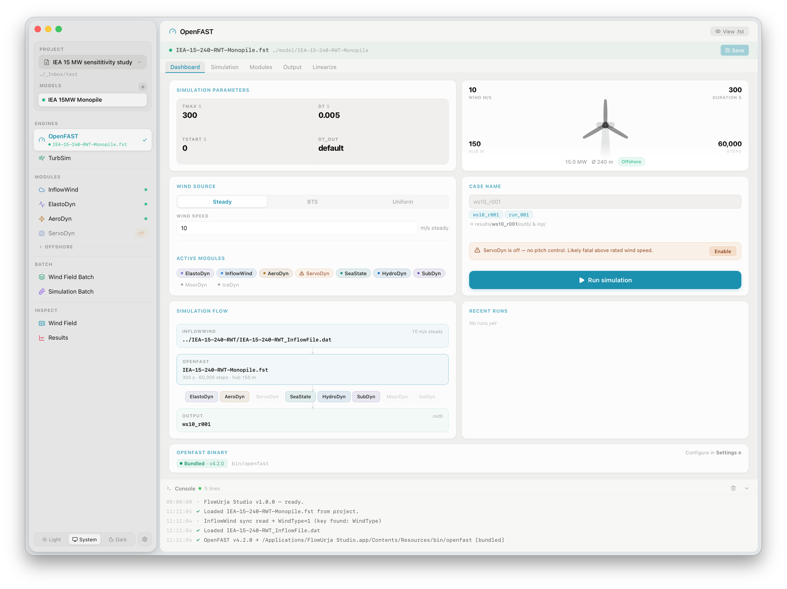

# FlowUrja Studio

**An open-source desktop GUI for OpenFAST and TurbSim wind turbine aeroelastic simulation.**

FlowUrja Studio brings OpenFAST and TurbSim into a unified native application — from turbulent wind field generation and parametric batch sweeps to aeroelastic simulation execution and results analysis — without requiring command-line expertise or scripting.

[](LICENSE)
[](#installation)
[](https://github.com/findmussa/flowurja-studio/releases/latest)
[](https://github.com/findmussa/flowurja-studio/actions/workflows/release.yml)

**Website & documentation**: [www.flowurjastudio.com](https://www.flowurjastudio.com)

**Download**
&nbsp;
[](https://github.com/findmussa/flowurja-studio/releases/latest)
[](https://github.com/findmussa/flowurja-studio/releases/latest)



---

## Features

- **Wind field generation** — TurbSim GUI with IEC turbulence classes (A/B/C), Kaimal and von Kármán spectral models, custom shear profiles, and gradient turbulence intensity (gTI) support
- **OpenFAST module editors** — guided panels for InflowWind, ElastoDyn, AeroDyn, ServoDyn, and offshore modules (HydroDyn, SubDyn, MoorDyn, SeaState, IceDyn)
- **Batch sweep generator** — parametric studies across wind speed, turbulence class, shear exponent, and gTI axes; factorial and paired modes
- **Simulation batch runner** — multiple OpenFAST cases prepared and launched automatically with live progress and console streaming
- **Results viewer** — time-series plots, scatter charts, power spectral density, channel selection, statistics, and CSV export
- **Wind field visualiser** — BTS binary file viewer with profile plots and grid-point coordinates
- **Bundled binaries** — ships with OpenFAST v4.2.0 and TurbSim v4.2.0; no separate installation required
- **Reference turbines** — NREL 5MW, IEA 10MW, IEA 15MW (monopile · UMaine semi · OLAF), IEA 22MW (monopile · semi)
- **Native on macOS and Windows** — built with Tauri; lightweight binary with no Electron overhead

---

## Installation

Download the installer for your platform from the [Releases](https://github.com/findmussa/flowurja-studio/releases/latest) page.

| Platform | Requirement | File |
|----------|------------|------|
| macOS | macOS 13 Ventura or later (Apple Silicon or Intel) | `.dmg` |
| Windows | Windows 10/11 (64-bit) | `_x64-setup.exe` |

**macOS:** Open the `.dmg`, drag FlowUrja Studio to Applications. On first launch, go to **System Settings → Privacy & Security → Open Anyway** if prompted.

**Windows:** Run the installer and follow the setup wizard. Click **More info → Run anyway** if Windows Defender SmartScreen appears.

No additional software (Python, OpenFAST, TurbSim) is required — everything is bundled.

For full installation instructions see [docs: Installation](https://www.flowurjastudio.com/getting-started/installation/).

---

## Quick start

1. Launch FlowUrja Studio and create a new project.
2. Select a reference turbine model (e.g. IEA 15MW Monopile).
3. Go to **TurbSim**, configure wind parameters, and click **Run TurbSim**.
4. Go to **OpenFAST**, set Wind Type to BTS, and click **Run simulation**.
5. Go to **Results**, scan for output files, and select channels to plot.

Full walkthrough: [docs: Quick Start](https://www.flowurjastudio.com/getting-started/quick-start/).

---

## Building from source

Requirements: [Node.js 20+](https://nodejs.org) · [Rust stable](https://rustup.rs) · [Python 3.11+](https://python.org)

```bash
git clone https://github.com/findmussa/flowurja-studio.git
cd flowurja-studio
npm install
npm run tauri dev        # development
npm run tauri build      # production build
```

The app ships with pre-built OpenFAST/TurbSim binaries in `src-tauri/resources/bin/`.
The Python sidecar (`fws_io.py`) runs directly in development; CI compiles it with PyInstaller for release builds.

---

## Citation

> **Citation details will be added here upon publication.**
>
> In the meantime, if you use FlowUrja Studio in your research, please visit
> [www.flowurjastudio.com](https://www.flowurjastudio.com) for the most up-to-date citation information.

---

## Third-party components

FlowUrja Studio bundles the following open-source software and reference turbine data:

| Component | Version | Reference | License |
|-----------|---------|-----------|---------|
| [OpenFAST](https://github.com/OpenFAST/openfast) | 4.2.0 | NREL | Apache 2.0 |
| [TurbSim](https://github.com/OpenFAST/openfast) | 4.2.0 | NREL | Apache 2.0 |
| [ROSCO](https://github.com/NREL/ROSCO) (libdiscon) | 2.10.1 | Abbas et al. (2022) | Apache 2.0 |
| [NREL 5MW RWT](https://github.com/OpenFAST/r-test/tree/main/glue-codes/openfast/5MW_Baseline) | — | Jonkman et al. (2009) | Apache 2.0 |
| [IEA 10MW RWT](https://github.com/IEAWindSystems/IEA-10.0-198-RWT) | — | Bortolotti et al. (2019) | CC BY 4.0 |
| [IEA 15MW RWT](https://github.com/IEAWindSystems/IEA-15-240-RWT) | — | Gaertner et al. (2020) | CC BY 4.0 |
| [IEA 22MW RWT](https://github.com/IEAWindSystems/IEA-22-280-RWT) | — | Zahle et al. (2024) | CC BY 4.0 |

Full attribution and license texts are in [NOTICE](NOTICE) and [LICENSES/](LICENSES/).

FlowUrja Studio is an independent open-source project and is not affiliated with or endorsed by NREL or IEA Wind.

### Key references

- Jonkman, J., Butterfield, S., Musial, W., & Scott, G. (2009). *Definition of a 5-MW reference wind turbine for offshore system development.* NREL/TP-500-38060.
- Bortolotti, P., et al. (2019). *IEA Wind Task 37 on Systems Engineering in Wind Energy — WP2.1 Reference Wind Turbines.* NREL/TP-73492.
- Gaertner, E., et al. (2020). *Definition of the IEA Wind 15-Megawatt Offshore Reference Wind Turbine.* NREL/TP-75698.
- Allen, C., et al. (2020). *Definition of the UMaine VolturnUS-S Reference Platform.* NREL/TP-76773.
- Zahle, F., et al. (2024). *Definition of the IEA Wind 22-Megawatt Offshore Reference Wind Turbine.* DTU Wind Report E-0243. https://doi.org/10.11581/DTU.00000317
- Abbas, N., et al. (2022). *A Reference Open-Source Controller for Fixed and Floating Offshore Wind Turbines.* Wind Energy Science. https://doi.org/10.5194/wes-7-53-2022

---

## AI-assisted development disclosure

AI-assisted tools were used during development to support code drafting, debugging, refactoring, documentation, and language editing. All code included in this release was reviewed, tested, and accepted by the authors. The authors take full responsibility for the design, correctness, and integrity of the released software.

---

## License

FlowUrja Studio is released under the [Apache License 2.0](LICENSE).

Copyright 2026 The Author(s).

---

## Developer

**Nur Mahammad Mussa Kalimullah, PhD**  
[www.flowurjastudio.com](https://www.flowurjastudio.com) · [findmussa.github.io](https://findmussa.github.io) · [LinkedIn](https://www.linkedin.com/in/findmussa/) · [ORCID 0000-0003-0447-6527](https://orcid.org/0000-0003-0447-6527)
